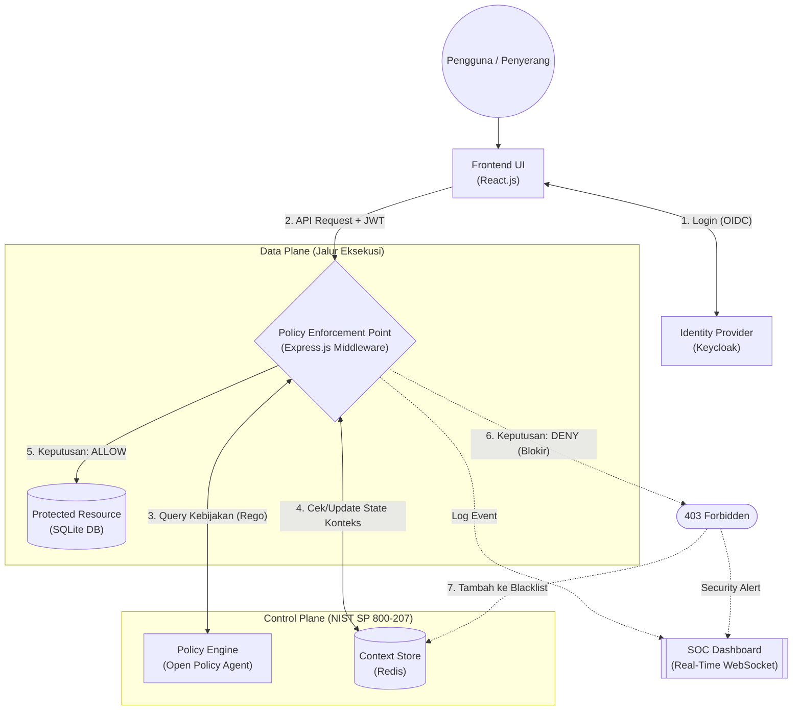
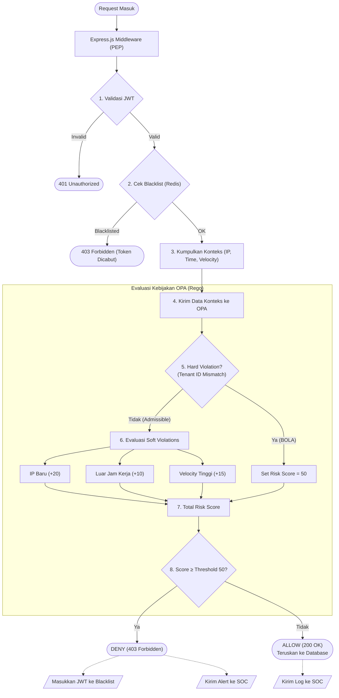
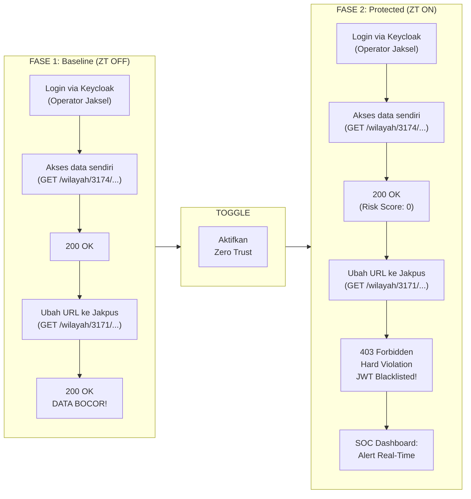

# BAB III: METODOLOGI

## 3.1 Tahapan Pelaksanaan

Penelitian ini mengembangkan *Proof of Concept* (PoC) sistem otorisasi berbasis *Context-Aware Zero Trust* pada REST API Multi-Tenant. Kontribusi utama penelitian mencakup: (1) implementasi mekanisme *Context-Aware Authorization* yang mengevaluasi atribut kontekstual pada setiap *request*, (2) implementasi model *Risk-Adaptive Authorization* yang mengklasifikasikan pelanggaran ke dalam *Hard Violation* dan *Soft Violation*, (3) implementasi komponen arsitektur *Zero Trust* sesuai NIST SP 800-207 [2] menggunakan teknologi standar industri, dan (4) evaluasi efektivitas mekanisme otorisasi terhadap skenario serangan *Broken Object Level Authorization* (BOLA) sebagai *use case* pengujian utama. Pelaksanaan dilakukan melalui lima tahapan yang disusun secara sistematis.

---

### Tahap 1: Studi Literatur dan Analisis Kebutuhan

Tahapan ini bertujuan untuk mengidentifikasi *state-of-the-art* dalam mekanisme otorisasi *context-aware* pada arsitektur *Zero Trust* dan memetakan *research gap* yang akan diisi oleh penelitian ini.

**Aktivitas yang dilakukan:**

1. **Kajian standar dan kerangka kerja industri** — Menelaah OWASP API Security Top 10 (2023) [1] untuk memahami karakteristik ancaman BOLA (*API1:2023*) sebagai risiko keamanan API nomor satu, serta NIST SP 800-207 [2] sebagai acuan arsitektur *Zero Trust* yang mensyaratkan evaluasi konteks jaringan, identitas, dan perilaku pada setiap *request*. Selain itu, dikaji NIST SP 800-162 [8] yang mendefinisikan kerangka kerja *Attribute-Based Access Control* (ABAC) sebagai landasan formal bagi model otorisasi berbasis atribut kontekstual yang diterapkan dalam penelitian ini.

2. **Kajian studi kasus kerentanan BOLA** — Menganalisis temuan Viriya & Muliono (2021) [3] yang membuktikan secara empiris bahwa aplikasi E-Commerce dan E-Banking di Indonesia masih rentan terhadap serangan BOLA. Penelitian tersebut menyoroti ketergantungan berlebihan pada keamanan *client-side* yang mudah ditembus, sehingga memvalidasi urgensi mekanisme otorisasi di sisi *server*. BOLA diposisikan sebagai *threat scenario* utama untuk mengevaluasi efektivitas mekanisme otorisasi yang dikembangkan, bukan sebagai satu-satunya fokus penelitian.

3. **Kajian arsitektur API Security Gateway Multi-Tenant** — Menganalisis *framework* keamanan API Gateway dari Mao dkk. (2025) [4] yang mengintegrasikan *Zero Trust Architecture*, OAuth 2.1, dan *policy engine* pada sistem Multi-Tenant berskala jutaan *request*. Dari penelitian tersebut diadopsi konsep *Threshold-Based Decision Function*, di mana keputusan otorisasi diambil melalui akumulasi bobot atribut kontekstual (*weighted score*) yang dibandingkan dengan nilai ambang batas (*threshold*). Mao dkk. juga menggunakan Open Policy Agent (OPA) sebagai *policy engine*, yang menjadi rujukan pemilihan teknologi dalam penelitian ini.

4. **Kajian model Risk-Adaptive Authorization** — Mempelajari model otorisasi adaptif berbasis risiko dari Kostiuk dkk. (2026) [5] yang menggunakan analisis berkelanjutan terhadap karakteristik perilaku pengguna, parameter perangkat, konteks jaringan, dan kritikalitas sumber daya untuk membentuk indikator risiko integral secara *real-time*. Pendekatan ini menjadi acuan utama desain model *Risk-Adaptive Authorization* pada sistem yang dikembangkan.

5. **Kajian deteksi BOLA pada REST API** — Menelaah Santos Filho dkk. (2025) [6] yang menunjukkan kompleksitas deteksi serangan BOLA pada REST API akibat sifat logika bisnis yang sangat dinamis. Temuan ini memvalidasi kebutuhan mekanisme pertahanan yang bersifat *context-aware* dan tertanam di dalam alur pemrosesan *request*.

6. **Kajian model Zero Trust Adaptive Authentication (ZeTHAA)** — Menganalisis framework *Zero-Trust Hybrid Adaptive Authentication* (ZeTHAA) dari Krishnan & Sreeja (2026) [7] yang diterbitkan di IEEE Access. Paper ini memperkenalkan **konsep *Global Admissibility Predicate*** — sebuah predikat formal yang memisahkan secara tegas antara **Hard Violation** (pelanggaran mutlak yang tidak dapat dikompensasi oleh sinyal konteks lainnya) dan **Probabilistic Soft Violation** (deviasi perilaku yang hanya menurunkan kepercayaan namun tidak langsung memblokir akses). Konsep ini menjadi landasan formal yang memvalidasi desain *Risk Scoring* dalam penelitian ini, khususnya pemisahan validasi kepemilikan *tenant* sebagai *Hard Violation* dari sinyal kontekstual lainnya sebagai *Soft Violation*.

7. **Analisis kebutuhan fungsional dan non-fungsional** — Berdasarkan hasil kajian di atas, diturunkan kebutuhan sistem berikut:

   **Kebutuhan Fungsional:**
   - REST API Multi-Tenant dengan minimal 3 *endpoint* CRUD yang mencakup operasi *read* dan *write*.
   - Autentikasi terpusat menggunakan *Identity Provider* (Keycloak) yang menerbitkan JSON Web Token (JWT) dengan *claim*: `user_id`, `tenant_id`, dan `role`.
   - *Policy Engine* berbasis Open Policy Agent (OPA) yang mengevaluasi kebijakan otorisasi menggunakan bahasa deklaratif Rego, memisahkan logika kebijakan dari logika bisnis (*Policy-as-Code*).
   - *Context-Aware Authorization* melalui Express.js *middleware* yang bertindak sebagai *Policy Enforcement Point* (PEP), mengumpulkan konteks *request* dan mengeksekusi keputusan dari *Policy Engine*.
   - Validasi kepemilikan *tenant* (*Tenant Ownership Validation*) sebagai kontrol utama mitigasi BOLA, diimplementasikan sebagai *Hard Violation* sesuai prinsip *Global Admissibility Predicate* [7].
   - Evaluasi sinyal kontekstual (*IP Address Profiling*, *Access Time Analysis*, *Velocity Check*) sebagai mekanisme *Continuous Verification* sesuai prinsip *Zero Trust* [2].
   - Mekanisme *JWT Blacklisting* menggunakan Redis untuk pencabutan akses paksa (*forced revocation*) terhadap token yang terdeteksi melakukan pelanggaran.
   - *Dashboard SOC (Security Operations Center)* yang menampilkan metrik keamanan secara *real-time* melalui koneksi WebSocket (Socket.IO).
   - *Toggle switch* untuk mengaktifkan/menonaktifkan mekanisme otorisasi dalam evaluasi komparatif (*baseline vs protected*).

   **Kebutuhan Non-Fungsional:**
   - *Overhead latency* keseluruhan pipeline otorisasi ≤ 100 ms per *request*.
   - *True Positive Rate* (TPR) deteksi serangan BOLA ≥ 95%.
   - *False Positive Rate* (FPR) ≤ 5%.
   - *Cross-Tenant Blocking Rate* ≥ 99% (mengacu *benchmark* Mao dkk. (2025) [4] yang mencapai 99,1%).

**Rujukan utama tahap ini:**

| No | Referensi | Relevansi | DOI / Akses |
|:--:|-----------|-----------|-------------|
| [1] | OWASP Foundation. (2023). *OWASP API Security Top 10 – 2023.* | Karakteristik ancaman BOLA sebagai *threat scenario* evaluasi | [owasp.org/API-Security](https://owasp.org/API-Security/editions/2023/en/0xa1-broken-object-level-authorization/) |
| [2] | Rose, S. et al. (2020). *Zero Trust Architecture.* NIST SP 800-207. | Acuan arsitektur Zero Trust: PE, PA, PEP, dan prinsip *continuous verification* | [doi.org/10.6028/NIST.SP.800-207](https://doi.org/10.6028/NIST.SP.800-207) |
| [3] | Viriya, A. & Muliono, Y. (2021). *Peeking and Testing BOLA Vulnerability.* Procedia Computer Science, 197. | Bukti empiris kerentanan BOLA pada aplikasi nyata di Indonesia | [doi.org/10.1016/j.procs.2021.01.101](https://doi.org/10.1016/j.procs.2021.01.101) |
| [4] | Mao, Y., Ma, X., & Li, J. (2025). *API Security Gateway for Multi-tenant Full-stack Systems.* IEEE BDAMEA 2025. | Arsitektur API Gateway Multi-Tenant dengan OPA, *Threshold-Based Decision Function* | [doi.org/10.1109/bdamea68159.2025.11406329](https://doi.org/10.1109/bdamea68159.2025.11406329) |
| [5] | Kostiuk, Yu.V. et al. (2026). *Risk-Adaptive Authorization in Zero Trust.* Problems in Programming, 2026(1). | Model Risk-Adaptive Authorization berbasis indikator risiko integral | [doi.org/10.15407/pp2026.01.066](https://doi.org/10.15407/pp2026.01.066) |
| [6] | Santos Filho, A. et al. (2025). *Automated BOLA Attack Detection in REST APIs.* Int. J. of Information Security. | Validasi kompleksitas deteksi BOLA pada REST API | [doi.org/10.1007/s10207-024-00970-5](https://doi.org/10.1007/s10207-024-00970-5) |
| [7] | Krishnan, V. & Sreeja, C.S. (2026). *Provably Adaptive Trust Dynamics in Zero-Trust Systems.* IEEE Access, Vol. 14. | Landasan formal *Global Admissibility Predicate* (Hard vs Soft Violation) | [doi.org/10.1109/ACCESS.2026.3695458](https://doi.org/10.1109/ACCESS.2026.3695458) |
| [8] | Hu, V.C. et al. (2014). *Guide to ABAC Definition and Considerations.* NIST SP 800-162. | Kerangka formal ABAC sebagai landasan model otorisasi berbasis atribut | [doi.org/10.6028/NIST.SP.800-162](https://doi.org/10.6028/NIST.SP.800-162) |

---

### Tahap 2: Perancangan Sistem dan Arsitektur Keamanan

Hasil analisis kebutuhan dari Tahap 1 diterjemahkan ke dalam rancangan arsitektur teknis yang mengacu pada model komponen *Zero Trust Architecture* dari NIST SP 800-207 [2]. Aktivitas yang dilakukan:

1. **Perancangan skema database Multi-Tenant** — Menggunakan pendekatan *shared database, shared schema* dengan kolom `tenant_id` (berupa `kode_wilayah`) sebagai diskriminator. Simulasi mengangkat skenario **Sistem Informasi Penduduk Terpadu (SIPT)** yang digunakan oleh beberapa satuan kerja BPS tingkat Kabupaten/Kota. Setiap *record* data penduduk (NIK, nama, status kemiskinan, kepemilikan aset) terikat secara ketat pada satu *tenant* (wilayah kerja) tertentu. Pemilihan domain ini didasarkan pada urgensi nyata: kebocoran data kependudukan *by name by address* lintas-wilayah merupakan pelanggaran UU Pelindungan Data Pribadi (UU No. 27 Tahun 2022) dan berpotensi mengancam keamanan nasional.

2. **Perancangan Identity Provider (Keycloak)** — Merancang Keycloak sebagai *Identity Provider* (IdP) terpusat yang bertanggung jawab atas autentikasi pengguna dan penerbitan JWT (*Access Token*). Keycloak dipilih karena: (a) merupakan implementasi standar OpenID Connect (OIDC) dan OAuth 2.0 yang sesuai dengan rekomendasi NIST SP 800-207 [2] untuk komponen *Identity Provider*; (b) mendukung konfigurasi *realm* dan *client* yang memungkinkan penyisipan *custom claim* (`tenant_id`, `role`) ke dalam token JWT; dan (c) bersifat *open-source* sehingga mendukung transparansi dan reprodusibilitas akademis. Token JWT yang diterbitkan oleh Keycloak memuat tiga *claim* utama: `user_id` (identitas pengguna), `tenant_id` (identitas *tenant*/wilayah kerja), dan `role` (peran otorisasi).

3. **Perancangan Policy Engine (Open Policy Agent / OPA)** — Merancang Open Policy Agent (OPA) sebagai *Policy Engine* (PE) yang mengevaluasi kebijakan otorisasi menggunakan bahasa deklaratif Rego. OPA dipilih berdasarkan justifikasi berikut:
   - **Pemisahan kebijakan dari logika bisnis** — OPA mengimplementasikan prinsip *Policy-as-Code* di mana aturan otorisasi ditulis secara deklaratif dan terpisah dari kode aplikasi, sesuai dengan model ABAC yang didefinisikan dalam NIST SP 800-162 [8].
   - **Kesesuaian dengan arsitektur Zero Trust modern** — Mao dkk. (2025) [4] menggunakan OPA sebagai *policy engine* dalam arsitektur API Gateway Multi-Tenant mereka, memvalidasi kesesuaian teknologi ini untuk konteks penelitian sejenis.
   - **Auditabilitas dan reprodusibilitas** — Kebijakan Rego bersifat deklaratif, dapat di-*version control*, dan mudah diaudit, mendukung transparansi yang diperlukan dalam penelitian akademis.

   **Penegasan:** Kontribusi penelitian ini **bukan** membangun OPA sebagai *tool*, melainkan merancang **model *Context-Aware Authorization* dan *Risk-Adaptive Authorization*** yang dijalankan di atas OPA. OPA berperan sebagai infrastruktur evaluasi kebijakan, sedangkan model risiko kontekstual merupakan kontribusi orisinal penelitian.

4. **Perancangan Policy Enforcement Point (Express.js Middleware)** — Merancang Express.js *middleware* kustom yang bertindak sebagai **Policy Enforcement Point (PEP)** sesuai model NIST SP 800-207 [2]. *Middleware* ini bertugas: (a) mencegat setiap *request* yang masuk, (b) mengekstrak konteks *request* (JWT *claims*, alamat IP, *timestamp*, frekuensi akses), (c) melakukan *query* ke OPA untuk mendapatkan keputusan otorisasi, dan (d) menegakkan (*enforce*) keputusan tersebut.

5. **Perancangan model Risk-Adaptive Authorization** — Merancang model otorisasi adaptif yang mengadopsi konsep *Threshold-Based Decision Function* dari Mao dkk. (2025) [4], model *Risk-Adaptive Authorization* dari Kostiuk dkk. (2026) [5], serta konsep **Global Admissibility Predicate** dari Krishnan & Sreeja (2026) [7]. Model ini memisahkan faktor risiko menjadi dua kategori yang berbeda secara fundamental:

   - **Hard Violation — Kontrol Mitigasi BOLA:** Validasi kepemilikan *tenant* (*Tenant Ownership Validation*) merupakan kontrol utama yang secara langsung memitigasi serangan BOLA. Jika `tenant_id` pada JWT tidak sesuai dengan `tenant_id` pada *resource* yang diminta, *request* langsung diblokir tanpa mempertimbangkan faktor konteks lainnya. Mekanisme ini mengimplementasikan prinsip *non-compensable failure* per definisi *Global Admissibility Predicate* [7].

   - **Soft Violation — Sinyal Risiko Kontekstual (*Contextual Risk Signals*):** Tiga faktor berikut **bukan** merupakan indikator BOLA secara langsung, melainkan sinyal risiko kontekstual yang digunakan dalam mekanisme *Continuous Verification* sesuai prinsip Zero Trust [2]:
     - **IP Address Profiling** — Kesesuaian IP *request* dengan profil historis pengguna yang tersimpan di Redis.
     - **Access Time Analysis** — Kesesuaian waktu akses dengan jam operasional normal.
     - **Velocity Check** — Deteksi frekuensi *request* abnormal menggunakan *sliding window counter* pada Redis.

   Ketiga sinyal kontekstual tersebut tidak cukup untuk memblokir akses secara individual. Namun, akumulasinya berkontribusi pada penilaian risiko holistik yang mendukung prinsip *"never trust, always verify"* dalam arsitektur Zero Trust.

6. **Perancangan Context Store (Redis)** — Merancang Redis sebagai *Context Information Repository* yang menyimpan: (a) profil IP historis per-pengguna, (b) *sliding window counter* untuk kalkulasi *Velocity*, dan (c) daftar hitam JWT (*blacklist*) untuk pencabutan akses paksa. Redis dipilih karena karakteristik *in-memory* yang mendukung latensi rendah pada operasi baca/tulis yang berfrekuensi tinggi.

7. **Perancangan dashboard SOC interaktif** — Mendesain antarmuka *dashboard* yang terdiri dari *Client/Attacker View* (simulasi *request*) dan *SOC Security Dashboard* (visualisasi *real-time*). Dashboard terhubung ke *backend* melalui **Socket.IO** untuk menerima *event* keamanan secara *real-time*. Dilengkapi *toggle switch* untuk mengaktifkan/menonaktifkan pipeline otorisasi saat demonstrasi evaluasi komparatif.

Detail arsitektur, pemetaan NIST, dan diagram disajikan pada **Subbab 3.2**.

---

### Tahap 3: Implementasi dan Pengembangan

Desain arsitektur direalisasikan ke dalam kode program. Rincian komponen implementasi:

| Komponen | Peran NIST SP 800-207 | Teknologi | Deskripsi |
|----------|:---------------------:|-----------|-----------|
| Identity Provider | **Identity Provider (IdP)** | Keycloak | Autentikasi pengguna via OpenID Connect. Menerbitkan JWT dengan *claim*: `user_id`, `tenant_id`, `role`. |
| API Gateway / Middleware | **Policy Enforcement Point (PEP)** | Express.js Middleware | Mencegat *request*, mengekstrak konteks, melakukan *query* ke OPA, dan menegakkan keputusan otorisasi. |
| Policy Engine | **Policy Engine (PE)** | Open Policy Agent (OPA) | Mengevaluasi kebijakan otorisasi yang ditulis dalam bahasa Rego. Menerima *input* konteks dari PEP dan mengembalikan keputusan *allow/deny* beserta *risk score*. |
| Context Store | **Context Information Repository** | Redis via `ioredis` | Menyimpan profil IP historis, *sliding window counter* untuk *Velocity*, dan daftar hitam JWT (*blacklist*). |
| Database | **Protected Resource** | SQLite via `better-sqlite3` | Data *seed* untuk minimal 3 *tenant* (wilayah BPS Kabupaten/Kota), masing-masing memiliki data penduduk (NIK, nama, status kemiskinan, kepemilikan aset) yang terisolasi. |
| Frontend Dashboard | — | React.js (Vite) | Tampilan simulasi *request* dan *SOC Dashboard* dengan *Risk Score Gauge* dan *security event log*. |
| Komunikasi Real-Time | — | Socket.IO | Setiap *event* keamanan (ALLOW/BLOCK) dikirim secara *real-time* dari PEP ke *Dashboard SOC*. |
| Toggle Zero Trust | — | React State + Backend Flag | Tombol *toggle* untuk mengaktifkan/menonaktifkan pipeline otorisasi, memungkinkan evaluasi komparatif *baseline vs protected*. |

**Justifikasi pemilihan Keycloak + OPA (bukan *middleware* kustom):**

Versi awal perancangan mempertimbangkan penggunaan *middleware* JavaScript kustom dengan konfigurasi JSON sebagai *policy engine*. Namun, pendekatan tersebut direvisi dengan justifikasi sebagai berikut:
- **Kesesuaian dengan NIST SP 800-207** — Standar NIST mensyaratkan pemisahan komponen *Identity Provider*, *Policy Engine*, dan *Policy Enforcement Point* sebagai entitas yang berbeda [2]. Penggunaan Keycloak (IdP) dan OPA (PE) yang terpisah dari Express.js (PEP) merefleksikan arsitektur referensi tersebut secara lebih akurat dibandingkan *middleware* monolitik.
- **Pemisahan kebijakan dari kode** — OPA memungkinkan kebijakan otorisasi ditulis dalam Rego secara deklaratif dan terpisah dari logika bisnis, sesuai prinsip ABAC dalam NIST SP 800-162 [8] dan praktik *Policy-as-Code* yang digunakan oleh Mao dkk. (2025) [4].
- **Validitas eksternal** — Penggunaan teknologi standar industri (Keycloak, OPA) meningkatkan validitas eksternal hasil penelitian, karena arsitektur yang diuji lebih dekat dengan implementasi nyata dibandingkan *middleware* kustom yang bersifat *ad hoc*.

**Catatan lingkup:** Penelitian ini merupakan simulasi akademik (*Proof-of-Concept*) dan bukan implementasi *enterprise-scale Zero Trust* secara penuh. Keycloak dijalankan dalam mode *development* tanpa konfigurasi *high availability*, dan OPA dijalankan sebagai *sidecar* lokal tanpa integrasi Kubernetes. Penyederhanaan ini dilakukan untuk memfokuskan evaluasi pada efektivitas model otorisasi kontekstual, bukan pada skalabilitas infrastruktur.

---

### Tahap 4: Pengujian dan Evaluasi

Pengujian dilakukan menggunakan pendekatan **Dual-Scenario Testing** yang mengadopsi pola metodologi *"Baseline vs Protected"* — membandingkan perilaku sistem saat pipeline otorisasi Zero Trust **dinonaktifkan** (baseline) versus **diaktifkan** (protected). Detail skenario dan metrik diuraikan pada **Subbab 3.3**.

---

### Tahap 5: Dokumentasi dan Penyusunan Laporan

1. **Dokumentasi teknis** — Instruksi instalasi, konfigurasi, dan pengoperasian PoC (README). Termasuk cara menjalankan Keycloak, OPA, Redis, *seed* database, dan menghubungkan *frontend* dengan *backend*.
2. **Analisis hasil** — Tabulasi kuantitatif dari metrik evaluasi (TPR, FPR, *Latency Overhead*, *Blocking Rate*) beserta pembahasan komparatif antara mode *baseline* dan *protected*.
3. **Kesimpulan dan saran** — Rangkuman temuan, keterbatasan PoC, dan rekomendasi pengembangan (misal: integrasi *Machine Learning* untuk deteksi anomali adaptif, implementasi *dynamic threshold* berbasis data historis, atau *deployment* pada infrastruktur *cloud-native*).
4. **Lampiran** — Kebijakan Rego kunci, konfigurasi Keycloak *realm*, konfigurasi Redis, *screenshot* hasil pengujian, dan rekaman demonstrasi *Dashboard SOC*.

---

## 3.2 Arsitektur dan Desain Sistem

### A. Pemetaan Komponen terhadap NIST SP 800-207

Arsitektur sistem dirancang dengan mengacu pada model komponen *Zero Trust Architecture* yang didefinisikan dalam NIST SP 800-207 [2]. Tabel berikut menunjukkan pemetaan antara komponen abstrak NIST dengan implementasi konkret pada PoC ini:

| Komponen NIST SP 800-207 | Fungsi dalam Arsitektur ZTA | Implementasi PoC | Teknologi |
|--------------------------|---------------------------|-------------------|-----------|
| **Identity Provider (IdP)** | Autentikasi pengguna dan penerbitan kredensial (*token*) | Autentikasi via OIDC, penerbitan JWT dengan *claim* `user_id`, `tenant_id`, `role` | Keycloak |
| **Policy Engine (PE)** | Evaluasi kebijakan otorisasi berdasarkan atribut dan konteks | Evaluasi kebijakan Rego: validasi *tenant ownership*, kalkulasi *risk score* dari sinyal kontekstual | Open Policy Agent (OPA) |
| **Policy Enforcement Point (PEP)** | Pencegatan *request* dan penegakan keputusan PE | *Middleware* Express.js: ekstraksi konteks, *query* ke OPA, eksekusi *allow/deny* | Express.js Middleware |
| **Policy Administrator (PA)** | Koordinasi antara PE dan PEP | Orkestrasi alur *request* antara PEP dan OPA | Express.js (Orchestrator) |
| **Context Information Repository** | Penyimpanan data kontekstual untuk evaluasi kebijakan | Profil IP historis, *velocity counter*, daftar hitam JWT | Redis |
| **Trust Evaluation Mechanism** | Mekanisme penilaian kepercayaan (*trust*) | Model *Risk Scoring*: *Hard Violation* (BOLA control) + *Soft Violation* (sinyal kontekstual) | Kebijakan Rego pada OPA |
| **Protected Resource** | Sumber daya yang dilindungi oleh mekanisme otorisasi | Data penduduk multi-tenant (*by name by address*) | SQLite Database |

**Catatan:** Pemetaan ini bersifat fungsional untuk keperluan PoC akademis. Pada implementasi *enterprise-scale*, komponen seperti *Policy Administrator* dan *Policy Engine* dapat dijalankan sebagai *microservice* terpisah dengan komunikasi antar-komponen yang lebih kompleks.

---

### B. Diagram Arsitektur Sistem

Diagram berikut menggambarkan arsitektur sistem secara keseluruhan, menunjukkan alur *request* dari pengguna hingga *protected resource*, serta interaksi antar-komponen Zero Trust.



**Keterangan Arsitektur:**
- **Keycloak** berperan sebagai *Identity Provider* yang mengautentikasi pengguna dan menerbitkan JWT. Keycloak tidak terlibat dalam keputusan otorisasi per-*request*; tugasnya selesai setelah token diterbitkan.
- **Express.js Middleware (PEP)** mencegat setiap *request*, mengekstrak konteks (JWT *claims*, IP *address*, *timestamp*, frekuensi akses dari Redis), dan mengirimkan konteks tersebut ke OPA untuk dievaluasi.
- **OPA (Policy Engine)** mengevaluasi kebijakan Rego berdasarkan konteks yang diterima dari PEP. Keputusan otorisasi (*allow/deny*) beserta *risk score* dikembalikan ke PEP untuk ditegakkan.
- **Redis (Context Store)** menyimpan data kontekstual yang diperlukan untuk evaluasi: profil IP historis, *velocity counter* (*sliding window*), dan daftar hitam JWT.
- **Toggle Switch** memungkinkan pipeline otorisasi diaktifkan/dinonaktifkan untuk evaluasi komparatif *baseline vs protected*.

---

### C. Diagram Alir — Logika Context-Aware Authorization

Flowchart berikut menggambarkan detail alur pengambilan keputusan otorisasi pada setiap *request*, termasuk interaksi antara PEP, OPA, dan Redis.



**Keterangan Alur:**
- **Langkah 1–2** merupakan validasi autentikasi dasar: verifikasi kriptografis JWT dan pengecekan *blacklist* di Redis.
- **Langkah 3** mengumpulkan konteks *request* dari berbagai sumber: alamat IP dari *header*, *timestamp* dari *server clock*, dan *velocity counter* dari Redis.
- **Langkah 4** mengirimkan seluruh konteks ke OPA sebagai *input* untuk evaluasi kebijakan Rego.
- **Langkah 5** merupakan **kontrol mitigasi BOLA**: jika `tenant_id` pada JWT tidak sesuai dengan `tenant_id` pada *resource*, *request* langsung ditolak (*Hard Violation*). Ini adalah satu-satunya langkah yang secara langsung mendeteksi serangan BOLA.
- **Langkah 6–7** merupakan evaluasi **sinyal risiko kontekstual** untuk *Continuous Verification* sesuai prinsip Zero Trust [2]. Ketiga sinyal ini bukan indikator BOLA, melainkan indikator anomali perilaku yang memperkaya penilaian risiko secara holistik.

---

### D. Justifikasi Bobot Risk Score dan Threshold

Desain bobot *Risk Score* dan nilai *threshold* didasarkan pada tiga prinsip: (1) konsep **Global Admissibility Predicate** dari Krishnan & Sreeja (2026) [7] yang secara formal memisahkan *Hard Violation* dari *Soft Violation*, (2) mekanisme *Threshold-Based Decision Function* dari Mao dkk. (2025) [4], dan (3) kerangka ABAC dari NIST SP 800-162 [8].

| Variabel | Bobot | Klasifikasi | Peran dalam Sistem | Justifikasi Akademis |
|----------|:-----:|:-----------:|:------------------:|---------------------|
| Tenant ID Mismatch | +50 | **Hard Violation** | **Kontrol mitigasi BOLA** | Indikasi langsung serangan BOLA (OWASP API1:2023 [1]). Sesuai *Global Admissibility Predicate* [7], pelanggaran ini bersifat *non-compensable* — satu deteksi langsung memenuhi *threshold*. Mao dkk. (2025) [4] mengkonfirmasi isolasi Tenant ID sebagai kontrol utama (*blocking rate* 99,1%). |
| Unknown IP Address | +20 | **Soft Violation** | **Sinyal kontekstual** (*Continuous Verification*) | NIST SP 800-207 [2] mensyaratkan evaluasi konteks jaringan. Kostiuk dkk. (2026) [5] mengklasifikasikan *"Network Context"* sebagai pilar risiko. Sinyal ini bukan indikator BOLA, melainkan indikator anomali jaringan. |
| Unusual Access Time | +10 | **Soft Violation** | **Sinyal kontekstual** (*Continuous Verification*) | Kostiuk dkk. (2026) [5] menggunakan *"Behavioral Characteristics"* termasuk waktu akses. Bobot kecil karena akses di luar jam kerja sering terjadi pada pengguna sah (lembur, tugas lapangan). |
| Velocity Exceeded | +15 | **Soft Violation** | **Sinyal kontekstual** (*Continuous Verification*) | Mao dkk. (2025) [4] mengidentifikasi *"High-frequency access manipulation"* sebagai pola serangan. Krishnan [7] memodelkan perilaku *retry* sebagai *probabilistic amplifier*. |

**Justifikasi nilai Threshold = 50:**

Nilai *threshold* 50 dirancang mengikuti prinsip **Global Admissibility Predicate** dari Krishnan & Sreeja (2026) [7], yang menyatakan bahwa keputusan blokir harus memiliki dua jalur yang terdistinsi secara formal:
- **Jalur Hard Violation** (Tenant Mismatch = +50): Satu kali pelanggaran kepemilikan objek langsung memenuhi *threshold* → pemblokiran total sebagai kontrol mitigasi BOLA. Ini merupakan *non-compensable failure* per definisi [7].
- **Jalur Akumulasi Soft Violation** (IP +20 + Waktu +10 + Velocity +15 = maks. +45): Kombinasi *seluruh* sinyal kontekstual secara bersamaan tetap tidak mencapai *threshold*, sehingga operator yang bekerja dari IP baru saat lembur di lapangan **tidak akan diblokir** — *False Positive* diminimalkan secara struktural.

Pada skala penelitian besar (Mao dkk., 2025 [4]), *threshold* ditentukan secara dinamis menggunakan *Machine Learning*. Pada skala PoC ini, nilai 50 adalah titik optimal yang mengimplementasikan prinsip *Global Admissibility Predicate* secara ringan melalui kebijakan Rego pada OPA.

---

### E. Struktur Kebijakan Otorisasi (OPA Rego)

Kebijakan otorisasi diimplementasikan menggunakan bahasa deklaratif **Rego** pada Open Policy Agent (OPA), menggantikan pendekatan *file* JSON statis. Pendekatan ini sesuai dengan prinsip *Policy-as-Code* yang direkomendasikan oleh Mao dkk. (2025) [4] dan kerangka ABAC dari NIST SP 800-162 [8].

Berikut adalah rancangan struktur kebijakan Rego yang relevan:

```rego
package zerotrust.authorization

import rego.v1

default decision := {"allow": false, "risk_score": 0, "reason": "default_deny"}

# --- HARD VIOLATION: Kontrol Mitigasi BOLA ---
# Tenant Ownership Validation (non-compensable)
hard_violation if {
    input.jwt.tenant_id != input.resource.tenant_id
}

# --- SOFT VIOLATIONS: Sinyal Risiko Kontekstual ---
ip_score := 20 if { not input.context.ip_known } else := 0
time_score := 10 if { not input.context.within_work_hours } else := 0
velocity_score := 15 if { input.context.request_rate > data.policy.max_rpm } else := 0

total_risk := ip_score + time_score + velocity_score

# --- KEPUTUSAN OTORISASI ---
decision := {"allow": false, "risk_score": 50, "reason": "hard_violation_tenant_mismatch"} if {
    hard_violation
}

decision := {"allow": false, "risk_score": total_risk, "reason": "soft_violation_threshold"} if {
    not hard_violation
    total_risk >= data.policy.threshold
}

decision := {"allow": true, "risk_score": total_risk, "reason": "access_granted"} if {
    not hard_violation
    total_risk < data.policy.threshold
}
```

**Keterangan:**
- Kebijakan Rego memisahkan secara eksplisit antara `hard_violation` (kontrol BOLA) dan evaluasi `total_risk` (sinyal kontekstual).
- Konfigurasi bobot dan *threshold* disimpan dalam `data.policy` yang dapat diperbarui tanpa mengubah logika kebijakan (*hot-reload*).
- Keputusan dikembalikan sebagai objek JSON yang memuat `allow` (boolean), `risk_score` (numerik), dan `reason` (string) untuk keperluan *logging* dan visualisasi pada *SOC Dashboard*.
- Struktur ini bersifat ilustratif; implementasi aktual dapat disesuaikan dengan kebutuhan pengujian tanpa mengubah logika inti.

---

## 3.3 Skenario Pengujian

Pengujian dilakukan menggunakan pendekatan **Dual-Scenario Testing** — membandingkan perilaku sistem saat pipeline otorisasi Zero Trust **dinonaktifkan** (Fase 1: *Baseline*) versus **diaktifkan** (Fase 2: *Protected*). Pola ini mengadopsi metodologi *"Sebelum dan Sesudah"* yang lazim digunakan dalam penelitian keamanan sistem.

**Konteks Simulasi:**
Sistem yang diuji mensimulasikan **Sistem Informasi Penduduk Terpadu (SIPT)** yang digunakan oleh beberapa satuan kerja BPS tingkat Kabupaten/Kota. Setiap satker BPS berperan sebagai *tenant* yang hanya berhak mengakses data penduduk di wilayah kerjanya masing-masing.

| Tenant | Kode Wilayah (`tenant_id`) | Deskripsi |
|--------|:--------------------------:|----------|
| BPS Kota Jakarta Selatan | `3174` | Mengelola data penduduk Jaksel |
| BPS Kota Jakarta Pusat | `3171` | Mengelola data penduduk Jakpus |
| BPS Kabupaten Bogor | `3201` | Mengelola data penduduk Kab. Bogor |

Contoh data penduduk (*seed*) dalam database:

| nik | nama | status_kemiskinan | aset_rumah | tenant_id |
|-----|------|:-----------------:|:----------:|:---------:|
| `3174-0001` | Andi Pratama | Desil 1 (Miskin) | Rp 50 Juta | `3174` |
| `3174-0002` | Rina Sari | Desil 3 | Rp 200 Juta | `3174` |
| `3171-0001` | Budi Santoso | Desil 1 (Miskin) | Rp 30 Juta | `3171` |
| `3171-0002` | Siti Nurhaliza | Desil 5 | Rp 1.2 Miliar | `3171` |

### A. Skenario Fase 1 — Baseline: Sistem Tanpa Zero Trust (Rentan)

Fase ini bertujuan membuktikan bahwa REST API Multi-Tenant yang hanya mengandalkan autentikasi JWT (via Keycloak) **tanpa** mekanisme otorisasi kontekstual rentan terhadap serangan BOLA dan tidak memiliki kemampuan evaluasi konteks.

| No | Skenario | Deskripsi | Ekspektasi Hasil |
|:--:|----------|-----------|-----------------|
| B1 | *Horizontal Privilege Escalation* (BOLA) | Operator BPS Jaksel (tenant `3174`) login via Keycloak, lalu mengubah `kode_wilayah` pada URL menjadi `3171` untuk mengakses data penduduk Jakpus: `GET /api/wilayah/3171/penduduk/3171-0002`. | **200 OK** — Data penduduk Jakpus berhasil diakses. Kebocoran data lintas-wilayah terjadi. |
| B2 | *Mass Object Enumeration* | Operator BPS Jaksel menjalankan skrip otomatis untuk melakukan iterasi pada seluruh NIK (`3171-0001` s.d. `3171-9999`) guna mengekstrak semua data penduduk wilayah Jakpus. | **200 OK** — Seluruh data kependudukan Jakpus berhasil diekstrak tanpa hambatan. |
| B3 | *Cross-Tenant Data Modification* | Operator BPS Jaksel mengirim *request* `PUT /api/wilayah/3171/penduduk/3171-0001` untuk mengubah `status_kemiskinan` penduduk Jakpus dari Desil 1 menjadi Desil 5. | **200 OK** — Data penduduk Jakpus berhasil dimanipulasi. |

### B. Skenario Fase 2 — Defense: Serangan BOLA (Cross-Tenant)

Serangan yang **sama persis** dengan Fase 1 diulangi setelah pipeline otorisasi Zero Trust diaktifkan. Skenario ini menguji efektivitas **kontrol mitigasi BOLA** (*Hard Violation*).

| No | Skenario | Ekspektasi Hasil | Risk Score | Aksi Tambahan |
|:--:|----------|-----------------|:----------:|--------------|
| D1 | *Horizontal Privilege Escalation* — Operator Jaksel akses data Jakpus | **403 Forbidden** — Tenant ID Mismatch terdeteksi oleh OPA (`3174` ≠ `3171`). | ≥ 50 | JWT di-*blacklist*. Alert muncul di SOC Dashboard. |
| D2 | *Mass Object Enumeration* — Iterasi otomatis NIK Jakpus | **403 Forbidden** — Tenant Mismatch terdeteksi pada *request* pertama. *Request* berikutnya ditolak oleh *blacklist* check. | ≥ 50 | JWT di-*blacklist*. SOC Dashboard menampilkan lonjakan serangan. |
| D3 | *Cross-Tenant Data Modification* — Manipulasi status kemiskinan Jakpus | **403 Forbidden** — Tenant ID Mismatch terdeteksi pada operasi tulis. | ≥ 50 | JWT di-*blacklist*. Alert muncul di SOC Dashboard. |

### C. Skenario Fase 2 — Defense: Sinyal Risiko Kontekstual

Skenario ini menguji efektivitas **sinyal risiko kontekstual** (*Soft Violation*) sebagai mekanisme *Continuous Verification*. Pengguna mengakses data dalam wilayahnya sendiri (tidak ada *Tenant Mismatch*), namun dengan kondisi kontekstual yang bervariasi.

| No | Skenario | Kondisi Kontekstual | Ekspektasi Hasil | Risk Score |
|:--:|----------|-------------------|-----------------|:----------:|
| C1 | Akses dari IP tidak dikenal | Tenant valid, IP baru, jam kerja, frekuensi normal | **200 OK** — Akses diizinkan dengan peningkatan risiko. | 20 |
| C2 | Akses di luar jam kerja | Tenant valid, IP terdaftar, di luar jam kerja, frekuensi normal | **200 OK** — Akses diizinkan dengan peningkatan risiko. | 10 |
| C3 | Akses dengan frekuensi tinggi | Tenant valid, IP terdaftar, jam kerja, frekuensi melebihi *threshold* | **200 OK** — Akses diizinkan dengan peningkatan risiko. | 15 |
| C4 | Kombinasi dua sinyal kontekstual | Tenant valid, IP baru, di luar jam kerja, frekuensi normal | **200 OK** — Akses diizinkan (skor masih di bawah *threshold*). | 30 |
| C5 | Kombinasi seluruh sinyal kontekstual | Tenant valid, IP baru, di luar jam kerja, frekuensi tinggi | **200 OK** — Akses diizinkan (skor maksimal 45, tetap di bawah *threshold* 50). | 45 |

**Catatan desain:** Skenario C5 menunjukkan bahwa meskipun **seluruh** sinyal kontekstual aktif secara bersamaan, total skor hanya mencapai 45 dan **tetap di bawah *threshold* 50**. Ini membuktikan bahwa desain bobot telah dioptimalkan: sinyal kontekstual berfungsi sebagai mekanisme *Continuous Verification* untuk meningkatkan *situational awareness*, bukan sebagai mekanisme blokir mandiri. Hanya validasi kepemilikan *tenant* (kontrol BOLA) yang memiliki kekuatan untuk memblokir akses secara independen.

### D. Skenario Validasi — Memastikan Akses Sah Tidak Terganggu (False Positive Test)

Skenario ini memastikan bahwa mekanisme otorisasi tidak memblokir pengguna yang sah (*legitimate user*), sehingga *False Positive Rate* tetap rendah.

| No | Skenario | Ekspektasi Hasil | Risk Score |
|:--:|----------|-----------------|:----------:|
| V1 | Operator BPS Jaksel mengakses data penduduk Jaksel sendiri, dari IP kantor terdaftar, di jam kerja, dengan frekuensi normal. | **200 OK** — Akses diizinkan. | 0 |
| V2 | Operator BPS Jaksel mengakses data wilayahnya sendiri dari IP baru (tugas lapangan). | **200 OK** — Akses diizinkan. | 20 |
| V3 | Operator BPS Jaksel mengakses data wilayahnya sendiri di luar jam kerja (lembur). | **200 OK** — Akses diizinkan. | 10 |
| V4 | Operator BPS Jaksel mengakses data wilayahnya sendiri dari IP baru, di luar jam kerja. | **200 OK** — Akses diizinkan. | 30 |
| V5 | Operator BPS Jaksel mengakses data wilayahnya sendiri dari IP baru, di luar jam kerja, dengan frekuensi tinggi (*batch upload* data). | **200 OK** — Akses diizinkan. | 45 |

### E. Metrik Evaluasi

| Metrik | Definisi | Formula | Target |
|--------|----------|---------|:------:|
| **True Positive Rate (TPR)** | Persentase serangan BOLA (cross-tenant) yang berhasil dideteksi dan diblokir. | TPR = TP / (TP + FN) × 100% | ≥ 95% |
| **False Positive Rate (FPR)** | Persentase *request* sah (same-tenant) yang salah diblokir. | FPR = FP / (FP + TN) × 100% | ≤ 5% |
| **Latency Overhead** | Selisih waktu respons rata-rata antara mode *baseline* dan *protected*. | ΔT = T_protected − T_baseline | ≤ 100 ms |
| **Cross-Tenant Blocking Rate** | Rasio serangan lintas-tenant yang berhasil diblokir terhadap total percobaan. | BR = blocked / total_attacks × 100% | ≥ 99% |

### F. Alat Pengujian

| Alat | Fungsi |
|------|--------|
| **Postman / cURL** | Mengirim *request* manual dan memanipulasi Object ID untuk simulasi serangan BOLA. |
| **Custom Script (Node.js)** | Pengujian otomatis, simulasi *Mass Object Enumeration*, dan pengukuran *latency* secara statistik. |
| **Redis CLI** | Memverifikasi isi *blacklist*, profil IP, dan *counter Velocity* secara langsung. |
| **OPA CLI / REST API** | Menguji kebijakan Rego secara terisolasi (*unit test*) sebelum integrasi dengan PEP. |
| **Frontend Dashboard** | Visualisasi hasil pengujian *real-time* melalui Socket.IO untuk keperluan presentasi. |

### G. Diagram Alur Demonstrasi (*Baseline vs Protected*)



---

## Referensi yang Digunakan dalam BAB III

| No | Referensi | DOI / Link |
|:--:|-----------|------------|
| [1] | OWASP Foundation. (2023). *OWASP API Security Top 10 – 2023.* | [owasp.org/API-Security](https://owasp.org/API-Security/) |
| [2] | Rose, S. et al. (2020). *Zero Trust Architecture.* NIST SP 800-207. | [doi.org/10.6028/NIST.SP.800-207](https://doi.org/10.6028/NIST.SP.800-207) |
| [3] | Viriya, A. & Muliono, Y. (2021). *Peeking and Testing BOLA Vulnerability onto E-Commerce and E-Banking Mobile Applications.* Procedia Computer Science, 197, pp. 1012-1018. | [doi.org/10.1016/j.procs.2021.01.101](https://doi.org/10.1016/j.procs.2021.01.101) |
| [4] | Mao, Y., Ma, X., & Li, J. (2025). *Research on API Security Gateway and Data Access Control Model for Multi-tenant Full-stack Systems.* 2025 IEEE BDAMEA, pp. 43-47. | [doi.org/10.1109/bdamea68159.2025.11406329](https://doi.org/10.1109/bdamea68159.2025.11406329) |
| [5] | Kostiuk, Yu.V., Skladannyi, P.M., & Hnatchenko, D.D. (2026). *Risk-Adaptive Authorization in Zero Trust with Dynamic Trust and Tokens.* Problems in Programming, 2026(1). | [doi.org/10.15407/pp2026.01.066](https://doi.org/10.15407/pp2026.01.066) |
| [6] | Santos Filho, A., Rodríguez, R.J., & Feitosa, E.L. (2025). *Automated BOLA Attack Detection in REST APIs through OpenAPI to Colored Petri Nets Transformation.* Int. J. of Information Security (Springer). | [doi.org/10.1007/s10207-024-00970-5](https://doi.org/10.1007/s10207-024-00970-5) |
| [7] | Krishnan, V. & Sreeja, C.S. (2026). *Provably Adaptive Trust Dynamics in Context-Aware Zero-Trust Systems: A Formal Framework for Continuous Verification.* IEEE Access, Vol. 14, pp. 77839–77878. | [doi.org/10.1109/ACCESS.2026.3695458](https://doi.org/10.1109/ACCESS.2026.3695458) |
| [8] | Hu, V.C., Ferraiolo, D., Kuhn, R. et al. (2014). *Guide to Attribute Based Access Control (ABAC) Definition and Considerations.* NIST SP 800-162. | [doi.org/10.6028/NIST.SP.800-162](https://doi.org/10.6028/NIST.SP.800-162) |
